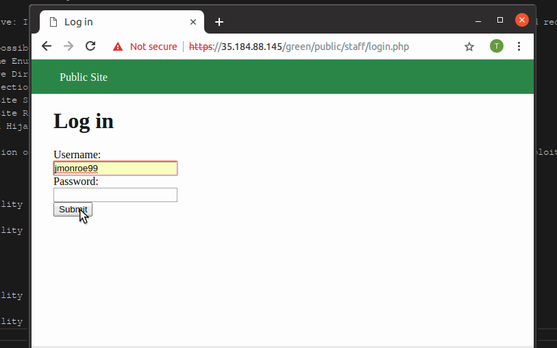

# codepath-course
Assignment submission repository for Facebook Codepath course

# Project 7 - WordPress Pentesting

Time spent: **3** hours spent in total

> Objective: Find, analyze, recreate, and document **five vulnerabilities** affecting an old version of WordPress

## Pentesting Report

1. (Required) Vulnerability Name or ID: Unauthenticated Stored Cross-Site Scripting (XSS) #7945
  - [ ] Summary: 
    - Vulnerability types: Cross-Site Scripting
    - Tested in version:
4.2.0
    - Fixed in version: 
4.2.1
  - [ ] GIF Walkthrough: 
  - [ ] Steps to recreate: 
    Craft a comment containing the following:
    ```html
    <a title='x onmouseover=alert(unescape(/hello%20world/.source)) style=position:absolute;left:0;top:0;width:5000px;height:5000px  AAAAAAAAAAAA...[64 kb]..AAA'></a>
    ```
  - [ ] Affected source code:
    - MySQL database truncates text fields longer than 64kB
    - [Link 1](https://core.trac.wordpress.org/browser/tags/version/src/source_file.php)
2. (Required) Vulnerability Name or ID: Authenticated Stored Cross-Site Scripting (XSS) #8111
  - [ ] Summary: 
    - Vulnerability types: Cross-Site Scripting
    - Tested in version:
    4.2.0
    - Fixed in version:
    4.2.3
  - [ ] GIF Walkthrough: 
  - [ ] Steps to recreate: 
    As a page editor, edit the text with to include the following HTML:
    ```html
    <a href="[caption code=">]</a><a title=" onmouseover=alert('test')  ">link</a>
    ```
    Navigate to the page and mouseover the link. The script in the link will be executed.
  - [ ] Affected source code:
    - [Link 1](https://core.trac.wordpress.org/browser/tags/version/src/source_file.php)
3. (Required) Vulnerability Name or ID: Large File Upload Error XSS #8819
  - [ ] Summary: 
    - Vulnerability types: Cross-Site Scripting
    - Tested in version:
    4.2.0
    - Fixed in version: 
    4.2.15
  - [ ] GIF Walkthrough: 
  - [ ] Steps to recreate:  
    Create a file larger than the website allows for storage (default is 20MB)  
    Rename it to include script in the filename: `Dinosaurs secret life.png`  
    Upload the file at `http://wpdistillery.vm/wp-admin/media-new.php` by dragging and dropping it.  
    Script executes when the page errors with `... exceeds the maximum upload size for this site.`  
  - [ ] Affected source code:
    - [Link 1](https://core.trac.wordpress.org/browser/tags/4.2/src/wp-includes/js/plupload/handlers.js)
    
## Assets

Custom crafted file `Dinosaurs secret.png`

## Resources

- [WordPress Source Browser](https://core.trac.wordpress.org/browser/)
- [WordPress Developer Reference](https://developer.wordpress.org/reference/)

GIFs created with [LiceCap](http://www.cockos.com/licecap/).

## Notes

Describe any challenges encountered while doing the work

## License

    Copyright 2018 Spencer Callicott

    Licensed under the Apache License, Version 2.0 (the "License");
    you may not use this file except in compliance with the License.
    You may obtain a copy of the License at

        http://www.apache.org/licenses/LICENSE-2.0

    Unless required by applicable law or agreed to in writing, software
    distributed under the License is distributed on an "AS IS" BASIS,
    WITHOUT WARRANTIES OR CONDITIONS OF ANY KIND, either express or implied.
    See the License for the specific language governing permissions and
    limitations under the License.

# Project 8 - Pentesting Live Targets

Time spent: 4 hours spent in total

> Objective: Identify vulnerabilities in three different versions of the Globitek website: blue, green, and red.

The six possible exploits are:
* Username Enumeration
* Insecure Direct Object Reference (IDOR)
* SQL Injection (SQLi)
* Cross-Site Scripting (XSS)
* Cross-Site Request Forgery (CSRF)
* Session Hijacking/Fixation

Each version of the site has been given two of the six vulnerabilities. (In other words, all six of the exploits should be assignable to one of the sites.)

## Blue

Vulnerability #1: SQLi (salesperson.php)


Vulnerability #2: Session Hijacking/Fixation (login.php)


## Green

Vulnerability #1: Username Enumeration (login.php)


Vulnerability #2: Stored XSS (feedback index.php)


## Red

Vulnerability #1: IDOR (salesperson.php)


Vulnerability #2: CSRF (contact.php)


## Notes

Describe any challenges encountered while doing the work

# Week 9
## Which Honeypot(s) you deployed
I deployed Ubuntu -- Dionaea with HTTP on Ubuntu 14.04

## Any issues you encountered
I encountered an issue installing the MVN framework due to a dependency that could not be located as the repostory for it doesn't exist any more. 

## A summary of the data collected: number of attacks, number of malware samples, etc.
In total, my honeypot collected no samples. A possible reason for this is that the server didn't have enough time to collect data from attackers. It could also be a configuration issue, since there were problems with the installation process.

The session.json file cannot be uploaded to github because it is empty.
## Any unresolved questions raised by the data collected
Why no attacks appeared from the honeypot server?

